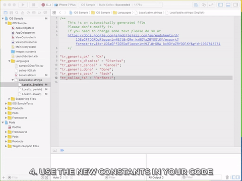

# Colloc: COLaborative LOCalizations for iOS & Android

Need to localize all strings in a project? Are you going to build the same App both for iOS & Android? This means `2*(number_languages)` and can grow pretty quick.

Wouldn't you like a simpler way to do this, while collaborating with your users, customers & team? Enter Colloc.

Colloc is a collaborative platform to manage the localizations for iOS and Android using a Spreadsheet.



You can see Colloc in action [here](doc/inaction.md)

## Using Colloc is really simple

### 1. Install Colloc

- just download [the script]((https://github.com/mobilejazz/Colloc/blob/master/colloc.php)) and [run it](doc/run.md) from the command line.
- install in an iOS project using CocoaPods

Read more about installing Colloc [here](doc/install.md)

### 2. Create a Spreadsheet containing all the text strings that need to be localized

Basically, you can define all the localization strings of your project in a user-friendly spreadsheet document as it is shown in the image. In this case is a Google Doc Spreadsheet, but you can use a LibreOffice ODS file or Microsoft Excel XLS.


Then, by runing a script you can export all the strings for all languages to iOS and/or Android format.

Learn more about Colloc spreadsheet's simple format and download a template [here](doc/spreadsheet.md)


### 3. Export the spreadsheet to a TSV text file

A TSV (Tab Separated Values) is nothing more than a text file with all the columns of your spreadsheet separated by TABs.

Lear more about [exporting your spreadsheet to TSV](doc/tsv.md)

### 4. Run the Colloc script

You can run Colloc directly from the command line, or integrate in your projects. Learn more about how to [run](doc/run.md) Colloc.


## Code Samples

You can find working samples in the [samples folder](Sample%20Projects)

## Language Support

Currently, Colloc supports the following languages:

| Language   | ISO639 |
|------------|--------|
| English    | en     |
| Spanish    | es     |
| Catalan    | ca     |
| Czech      | cs     |
| German     | de     |
| French     | fr     |
| Italian    | it     |
| Portuguese | pt     |
| Dutch      | nl     |
| Swedish    | sv     |
| Arabic     | ar     |
| Polish     | pl     |
| Portuguese | pt     |
| Russian    | ru     |
| Turkish    | tr     |
| Chinese    | zh     |
| Greek      | el     |
| Japanese   | ja     |

To use colloc with a different language, just use in the first row of the language-column the ISO639 language code (colloc translates the Language name to the ISO630 if available, otherwise uses the available language name as the language code).

---

## Colloc Best Practices 

All apps at Mobile Jazz should be ready for translation. This document groups different rules that some members of the team were already applying so in the future is clear for everyone. 

We use Colloc for translations in iOS and Android on the web we use. 

### Integrating colloc in the app 

Create a new spreadsheet in the Google Drive shared with the client, so the client can review and change strings by itself. 
You can use the template included in this repository.

For development purposes you can use the following snippet to use Google Translator in a cell: 

```
=GOOGLETRANSLATE(string_key,origin_language,target_language)

// Example: 
=GOOGLETRANSLATE($B34,$B$2,D$2)
```

Note: **It is important to integrate colloc from the beginning of the development** because finding all the strings later is time consuming and frustrating (specially if the person localizing the app is not the same as the person that created the UI). 

### Key conventions
Apart of the colloc conventions like using “#” for comments we use the following convention for keys: 

```
ls_screen_name_screen_component_hint_string
```

Where: 

- ls stands for localized string 
- screen_name for the screen in which is displayed. Example: login
- component for the UI component in which is shown. Example: button 
- hint is a hint that gives meaning about the string purpose. Example: forgot password

Example: 

```
ls_login_button_forgot_password
```

### Spreadsheet conventions

#### 1. Organization
Try to be organized. Group strings by screens and components and use headers to make the separation clear 


#### 2. Avoid reusing strings  
Add a different string for each component that uses it. Even if it is the exact same string.

Doing so, when the client asks for a change in a particular screen we can make a safe change and we don’t affect other screens. 

#### 3. Generic strings
Generic strings are the exceptions to the previous rule. 

At the beginning of the screen you can add a list of generic strings that might be used along the app like: Ok, Accept, Yes, No, Close, Back, Warning… 

For this particular case use ls_generic_string pattern. For example: `ls_generic_ok`, `ls_generic_accept`, ... 

---
## License

Copyright 2015 Mobile Jazz SL

Licensed under the Apache License, Version 2.0 (the "License");
you may not use this file except in compliance with the License.
You may obtain a copy of the License at

http://www.apache.org/licenses/LICENSE-2.0

Unless required by applicable law or agreed to in writing, software
distributed under the License is distributed on an "AS IS" BASIS,
WITHOUT WARRANTIES OR CONDITIONS OF ANY KIND, either express or implied.
See the License for the specific language governing permissions and
limitations under the License.
