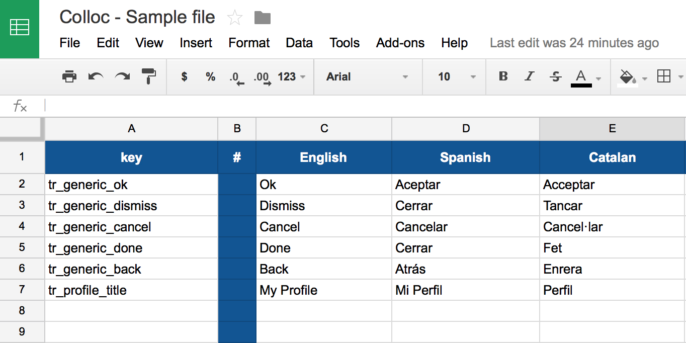

# Colloc
Colloc is a collaborative platform to manage the localizations for iOS and Android using a Google Document.

Basically, you can define all the localization strings of your project in a user-friendly google spreadsheet document as it is shown in the image.



Then, by runing a script you can export all the strings for all languages to iOS and/or Android format.

## Installation

There is only one file needed: the `colloc.php` file. Therefore the options are:

- Download the `colloc.php` file manually and add it to your project.
- Use the Cocoa Pod to get the file:
```
pod 'Colloc', :git => 'https://github.com/mobilejazz/Colloc.git'
```

## 1. Defining the Google Spreadsheet

Create a new Google spreadsheet document and configure it as follows:

1. The first column is used to store the keys of your strings. Keys must have only characters `A-Z`, `a-z`, `0-9` and `_`. Using any other character spaces or `-` may result in a building failure in your project. 
2. The first row of the first column must contain the title `Key` to indicate to the script that column contains keys.
3. For each language you want to support, fill a new column with its translations.
4. Use the first row of a language-column to indicate the name of language: `English`, `Spanish`, etc. Check on section 4 the supported languages.
5. Adding the char `#` in the first row of a column will indicate the script to ignore that column. Use this to add "comments" columns, "char counts" columns, etc.
6. Adding the char `#` as the first character of the first column of a row will indicate the script to ignore that row. Use this to ignore a specific key with its translations.
7. The `#` char can be used inside translations.
8. To add placeholders in your strings (for adding in runtime numbers, strings, ...) use the conventions listed in the table below. Colloc will take care to convert them to the platform-specific (iOS/Android) standard.

| Type            | Colloc | Example Key             | Example Translation              |
|-----------------|--------|-------------------------|----------------------------------|
| string          | %@     | ls_user_name            | My username is %@                |
| integer         | %d     | ls_user_age             | My age is %ld                    |
| float           | %f     | ls_city_distance_meters | The city is %fm away             |
| float precision | %.2f   | ls_number_two_decimals  | A number with two decimals: %.2f |


### 1.1 Best Practices

- Create a "generic" set of translations to handle generic strings: "done", "save", "back", "cancel", "dismiss", etc.
- It is a good practice to use a reverse domain notation to define the names of your keys. This will be useful to group them by module or category and to find them when using Xcode autocompletion.
- Also, it is a very good pratcie to start all your keys with a prefix. For example "tr_" or "ls_" (from translation and localized string).

For example:
```
ls_generic_done
ls_generic_save
ls_generic_cancel
[...]
ls_profile_title
ls_profile_user_name
ls_profile_user_description
ls_profile_edit_user_name_placeholder
ls_profile_edit_user_description_placeholder
[...]
```


## 2. Retrieving the Google Spreadsheet URL

The `colloc.php` script needs the Google spreadsheet exported as a `.tsv` file. You can use directly a local `.tsv` file or retrieve the Google spreadsheet exporting URL path. 

To get the exporting to `.tsv` URL just open the spreadsheet and select "File" > "Download as" > "Tab-spearated values (.tsv)". Your browser will download then the document. Then open the downloads manager and copy the download link from it.

## 3. Exporting strings

### 3.1. To iOS

To export to iOS just create a new bash script and execute the `colloc.php` file with the appropiate arguments.

For example:

```
#!/bin/sh

##
# The Google Document .tsv file path.
# In this example we are using a local file. However you can point directly to the .tsv export of a google doc file.
# To get the url just export your spreadsheet in tsv format and retrieve the download url from your browser.
GDOC_PATH="<THE_URL_TO_THE_GOOGLE_SPREADSHEET_EXPORTED_AS_TSV>"

##
# The colloc script path from the pod path.
##
COLLOC_PATH="../../Pods/Colloc/colloc.php"


OUTPUT_FOLDER_NAME="." # Put the localization files in the same folder as the script
OUTPUT_TYPE="100" #100 for iOS export

exec "php" "$COLLOC_PATH" "$GDOC_PATH" "$OUTPUT_FOLDER_NAME" "$OUTPUT_TYPE"
```

When executing this script it will generate all the `en.lproj`, `es.lproj`, etc. containing the `Localizable.strings`files for each defiend language. Add them to your Xcode project and you are ready to go.

It is a good practice to create a *Languages* folder in your Xcode project and add inside the the custom script as well as all the `Localizable.string` generated files.

Also, **Colloc** will generate an auto-generated `Localization.h` file that includes defininitions of all translation entries:

```
#define <my_key> NSLocalizedString(@"my_key",nil)
```

Import this file in your `.pch` project file. This way, you can easily use your localized strings. Otherwise, import the file in your preferred classes.

Becasue we are generating `#define` statements, Xcode will  provide autocompletion when using them:


For a easier usage, create a new Target in your Xcode project with the script above as a build phase. Then just by runing the schema corresponding to that target you will be able to update the localization files from the spreadsheet values.

### 3.2. To Android

To export to iOS just create a new bash script and execute the `colloc.php` file with the appropiate arguments.

For example:

```
#!/bin/sh

##
# The Google Document .tsv file path.
# In this example we are using a local file. However you can point directly to the .tsv export of a google doc file.
# To get the url just export your spreadsheet in tsv format and retrieve the download url from your browser.
GDOC_PATH="<THE_URL_TO_THE_GOOGLE_SPREADSHEET_EXPORTED_AS_TSV>"

##
# The colloc script path from the pod path.
##
COLLOC_PATH="../../Pods/Colloc/colloc.php"


OUTPUT_FOLDER_NAME="." # Put the localization files in the same folder as the script
OUTPUT_TYPE="010" #010 for Android export

exec "php" "$COLLOC_PATH" "$GDOC_PATH" "$OUTPUT_FOLDER_NAME" "$OUTPUT_TYPE"
```
When executing this script it will generate the Android localization files for all languages. Just import them to your project and you are ready to go.

### 3.3. Generic export

If you want to export in both iOS and Android in the same script, you must set the `OUTPUT_TYPE` to `110`.

```
OUTPUT_TYPE="110" #110 for iOS and Android export
```

## 4 Language Support

Currently, Colloc only supports the following languages:

| Language   | ISO639 |
|------------|--------|
| English    | en     |
| Spanish    | es     |
| Catalan    | ca     |
| German     | de     |
| French     | fr     |
| Italian    | it     |
| Portuguese | pt     |
| Dutch      | nl     |
| Swedish    | sv     |
| Arabic     | ar     |
| Polish     | pl     |
| Portuguese | pt     |
| Russian    | ru     |
| Turkish    | tr     |
| Chinese    | zh     |

To use colloc with a different language, just use in the first row of the language-column the ISO639 language code (colloc translates the Language name to the ISO630 if available, otherwise uses the available language name as the language code).

---
# License

Copyright 2015 Mobile Jazz SL

Licensed under the Apache License, Version 2.0 (the "License");
you may not use this file except in compliance with the License.
You may obtain a copy of the License at

http://www.apache.org/licenses/LICENSE-2.0

Unless required by applicable law or agreed to in writing, software
distributed under the License is distributed on an "AS IS" BASIS,
WITHOUT WARRANTIES OR CONDITIONS OF ANY KIND, either express or implied.
See the License for the specific language governing permissions and
limitations under the License.
