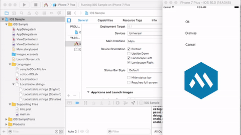

# Colloc Samples

## iOS (Objective-C) sample

- go to `iOS Sample` folder
- run from command line: `pod repo update; pod install`. You need to have [CocoaPods](https://cocoapods.org/) installed in your system.
- open the resulting .XCWorkspace file

## See it working

