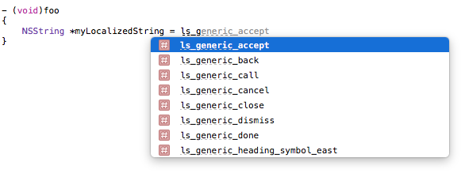
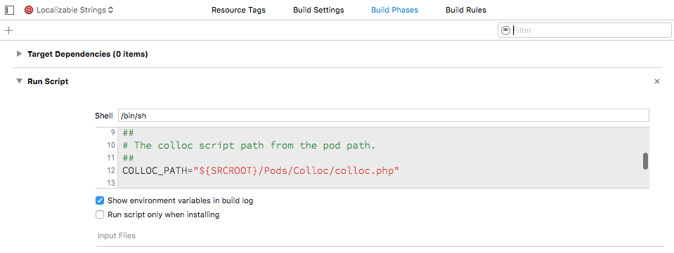

# Running Colloc

## Running Colloc from the command line

```
$ php colloc.php <URL_TO_THE_GOOGLE_SPREADSHEET_EXPORTED_AS_TSV_OR_TSV_LOCAL_FILE> output_path output_type
```

Where:

- URL_TO_THE_GOOGLE_SPREADSHEET_EXPORTED_AS_TSV_OR_TSV_LOCAL_FILE: URL that points to the TSV version of your Google Spreadsheet or path to the TSV file stored on your computer.
- output_path: path of the folder where all colloc files are going to be generated
- output_type:
    - 100: generates iOS (Objective-C + Swift) output
    - 010: generates only Android output
    - 110: generates iOS + Android output

### From Xcode (for iOS)

To export to iOS just create a new bash script and execute the `colloc.php` file with the appropiate arguments.


For example:

```
#!/bin/sh

##
# The Google Document .tsv file path.
# In this example we are using a local file. However you can point directly to the .tsv export of a google doc file.
# To get the url just export your spreadsheet in tsv format and retrieve the download url from your browser.
GDOC_PATH="<THE_URL_TO_THE_GOOGLE_SPREADSHEET_EXPORTED_AS_TSV>"

##
# The colloc script path from the pod path.
##
COLLOC_PATH="../../Pods/Colloc/colloc.php"


OUTPUT_FOLDER_NAME="." # Put the localization files in the same folder as the script
OUTPUT_TYPE="100" #100 for iOS export

exec "php" "$COLLOC_PATH" "$GDOC_PATH" "$OUTPUT_FOLDER_NAME" "$OUTPUT_TYPE"
```

When executing this script it will generate all the `en.lproj`, `es.lproj`, etc. containing the `Localizable.strings`files for each defiend language. Add them to your Xcode project and you are ready to go.

It is a good practice to create a *Languages* folder in your Xcode project and add inside the the custom script as well as all the `Localizable.string` generated files.

Also, **Colloc** will generate an auto-generated `Localization.h` and `Colloc.swift` files that includes defininitions of all translation entries:

```
#define <my_key> NSLocalizedString(@"my_key",nil)
```

Import this file in your `.pch` project file. This way, you can easily use your localized strings. Otherwise, import the file in your preferred classes.

Becasue we are generating `#define` statements, Xcode will  provide autocompletion when using them:



For a easier usage, create a new Target in your Xcode project with the script above as a build phase. Then just by runing the schema corresponding to that target you will be able to update the localization files from the spreadsheet values.




### 3.2. To Android

To export to iOS just create a new bash script and execute the `colloc.php` file with the appropiate arguments.

For example, for UNIX systems:

```
#!/bin/sh

##
# The Google Document .tsv file path.
# In this example we are using a local file. However you can point directly to the .tsv export of a google doc file.
# To get the url just export your spreadsheet in tsv format and retrieve the download url from your browser.
GDOC_PATH="<THE_URL_TO_THE_GOOGLE_SPREADSHEET_EXPORTED_AS_TSV>"

##
# The colloc script path from the pod path.
##
COLLOC_PATH="../../Pods/Colloc/colloc.php"


OUTPUT_FOLDER_NAME="." # Put the localization files in the same folder as the script
OUTPUT_TYPE="010" #010 for Android export

exec "php" "$COLLOC_PATH" "$GDOC_PATH" "$OUTPUT_FOLDER_NAME" "$OUTPUT_TYPE"
```

When executing this script it will generate the Android localization files for all languages. Just import them to your project and you are ready to go.

You have an example of this script in [colloc.sh](../colloc.sh). Remember to give the script executable permissions (`chmod a+x colloc.sh`)

### 3.3. Generic export

If you want to export in both iOS and Android in the same script, you must set the `OUTPUT_TYPE` to `110`.

```
OUTPUT_TYPE="110" #110 for iOS and Android export
```
